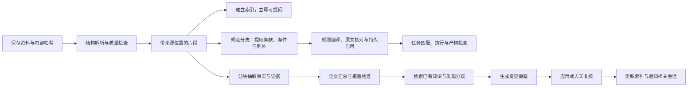

# WinAgent Wiki 2.0：资料、知识与对话的一体化工作区

日期：2026-09-27。状态：长期设计与分阶段实施依据；v0.5.0 已实现首轮核心链路，具体已实现能力与限制以 README 为准。

实施补充：用户明确无需兼容旧笔记，取消第 10 节的旧库迁移要求。重新分析直接覆盖对应 AI 知识正文；原始资料保留。当前实现使用每记录原子 JSON 文件持久化，未引入 SQLite。规范检查先覆盖聊天正文的模型评估，实际生成文件的内容和版式保留人工核验，不宣称自动验收。

交互方向更新（2026-09-28）：以 ZCode 的工作台组织为参考，左侧“助理”“专题任务”“Skills 与 MCP”“Wiki 知识库”并列。助理使用固定聊天访问整个 Wiki；专题任务使用独立聊天和自动生成的 `专题:<名称>` 标签，Wiki 阅读页可直接增删标签。专题检索、规范和工具范围由服务层约束为已标记资料。Wiki 不再另设右侧对话，引用会返回当前聊天；阅读位置与聊天草稿可恢复。Skills 与 MCP 页面负责追加技能目录、编辑连接配置和展示当前真实工具。ZCode 的许可与实际复用清单见 `third-party/ZCode/NOTICE.md`。

## 1. 核心判断

Wiki 应成为 WinAgent 的持久知识层：用户把资料交进来，能够立即阅读和提问；AI 持续整理，结论能够追溯、修订和复用。主界面负责讨论和执行，知识工作区负责阅读和沉淀，两者共享会话、选区、引用与任务状态。

用户明确需要同时覆盖资料研究、长期知识积累和任务执行。当前痛点是：知识提取过于笼统、阅读不便、主聊天无法直接有效调用知识、Wiki 与主界面割裂，以及导入的规范不会约束后续任务。

完整闭环为“资料研究 → 详细知识沉淀 → 持久规则启用 → 任务执行 → 产物检查 → 继续积累”。默认个人工作区即可使用，不要求先创建项目、配置模板或理解 raw / concepts / entities。

Wiki 同时提供两种读取面：人读的详细文章、章节和证据；模型读取的结构化知识包与任务规则包。两种读取面必须来自同一份版本化内容，避免人看一套、模型用另一套。

成功标准：导入后知道发生了什么；看结论时能核对原文；聊天知道用了哪些资料；一次整理能在以后用起来。

## 2. 当前实现的问题与依据

以下为当前代码阅读结果；用户实际工作流仍需用具体操作验证。旧 WIKI_DESIGN_REPORT.md 包含已经移除的 Rust 实现描述，不作为当前运行状态的唯一依据。

| 当前实现 | 对用户的影响 | 改造方向 |
| --- | --- | --- |
| App.tsx 的知识库入口打开独立窗口；WikiWindowApp 有独立 QueryDialog | 聊天与研究上下文需要来回切换 | 默认嵌入同一主窗口，同一个聊天会话；独立窗口作为可选阅读窗口 |
| WikiSidebar 以目录树为核心，WikiRightPanel 默认从标签开始 | 用户先理解文件组织，才能找到要做的事 | 按资料、专题、待整理组织；目录树降为高级视图 |
| WikiWindowApp 和 WikiLayout 分别调用 useWiki，各自持有 currentNote | 外层工作流选中页面与内层阅读器状态可能分离 | 单一共享工作区状态，实体缓存与视图选择分开 |
| AiPipeline.analyze 截断到 4000 字符，ingestSource 截断到 6000 字符，定制分析也截断到 6000 | 长文后半部分可能没有参与分析 | 按结构分块，记录实际解析/分析覆盖范围，支持增量汇总 |
| ingestSource 明确要求 2–4 句摘要、3–8 条一句话要点、一句话概念定义，新增概念页其余章节写“待补充” | 即使换更强模型，输出契约也在限制知识深度 | 把摘要降为导航，另设详细知识单元与规则编译输出 |
| WikiEditor 的二进制原文区域提示 PDF/图片不能预览 | 用户无法直接核对 AI 结论 | PDF 页码定位、原文选区与证据预览 |
| SearchIndex 主要是内存关键词检索；KnowledgeRetriever 查询截断到 200 字符，每条注入至多 200 字符摘要 | 问法变化容易漏检，命中摘要也不足以支撑细节问题 | 先建立可定位的片段检索，再按需叠加语义检索与重排 |
| runIngest 直接写来源页与概念页；已有概念按摄入次数增加 source_count | 重复导入可能影响计数，用户修改与新分析难以区分 | 来源版本去重、证据集合计数、变更提案与局部应用 |
| confidence 可按来源数量升级 | 数量容易被误读为真实性或独立验证 | 展示证据来源、独立性、矛盾、用户核验状态，避免统一“可信度分数” |
| 批处理状态驻留内存；AiPipeline 用 analyze/custom/ingest 类型作为操作 key | 重启续跑、跨窗口任务状态、单任务取消都不够清楚 | 持久任务记录、独立 jobId、阶段检查点、单任务取消 |
| AgentService 把自动检索摘要附在当轮 user 消息，检索失败跳过；没有任务规则解析器 | 导入论文规范不会保证在写作时加载，压缩后也不能保证持续约束 | 独立 RuleResolver + TaskContextBuilder + 产物检查器 |
| 健康检查、合并、问答、反思等集中在工作流按钮和弹窗 | 用户需要记住功能名，产出与下一步脱节 | 在资料、专题和待整理中的具体问题旁提供动作 |

主要代码入口：

- [主界面](../src/renderer/src/App.tsx)、[Wiki 窗口](../src/renderer/src/components/wiki/WikiWindowApp.tsx)、[Wiki 布局](../src/renderer/src/components/wiki/WikiLayout.tsx)、[共享状态现状](../src/renderer/src/lib/useWiki.ts)。
- [分析管线](../dsh-plugin/src/wiki/AiPipeline.ts)、[导入编排](../dsh-plugin/src/wiki/wiki-host.ts)、[自动检索](../dsh-plugin/src/wiki/KnowledgeRetriever.ts)、[搜索索引](../dsh-plugin/src/wiki/SearchIndex.ts)。

## 3. 信息架构：五个日常入口

### 对话

保留 WinAgent 的主入口。当前会话上方展示知识范围；回答中的证据编号可以直接打开旁边的原文。用户可以在输入区固定资料、专题或选区。对话产出的总结可以保存成知识笔记。

### 资料

展示实际导入的 PDF、网页、Word、表格、图片、Markdown 和手写笔记。默认列表支持搜索、最近使用、类型与处理状态筛选。每行只显示标题、来源/日期、处理状态和一个主要动作。批量选择后再展示“加入专题、对比分析、归档”等动作。

资料详情包含：原文、摘要、提取要点、相关笔记和处理记录。原始资料与 AI 派生结果保持可辨认，用户无需在 raw 和 sources 两个目录里反复寻找同一份资料。

### 专题

把资料、已确认知识、开放问题和研究会话组合成一个工作对象，例如“毕业论文”“产品竞品”“本地知识库”。专题既可以手动建立，也可以由 AI 建议；AI 不擅自大规模分类搬动文件。

专题首页展示一段可编辑简介、当前研究问题、相关资料、已有结论和待解决分歧。概念和实体是可选的组织方式，不要求每个导入文件都生成一批空概念页。

### 待整理

统一处理有明确决策需求的事项：新知识草稿、已有笔记更新、疑似重复、观点冲突、来源变化、解析受限。每项都说明“为什么出现、影响什么、建议做什么”。支持接受、修改、稍后、忽略；普通导入与读取不被人工审核阻塞。

任务列表属于全局状态入口，管理解析与分析的运行状态。它与“待整理”分开：前者是机器在做的工作，后者是需要人判断的知识问题。

### 规则

规则与普通知识并列，明确表示“以后做这类任务时按它执行”。展示规范标题、适用任务、作用范围、版本、启用状态和最近使用情况。进入后同时显示通俗说明、原文依据和可检查条款。

常见规则集：论文写作规范、某项目的编码约定、报告模板要求、公司文书格式。手写笔记和历史回答默认属于知识，只有用户明确指定为规则或启用提案后，才成为持久任务要求。导入时若用户已说“之后写论文都按这个”，就直接作为授权建立规则集，不再重复确认整份规范。

## 4. 主界面与 Wiki 的连接

统一外壳：左侧导航与专题，中间主工作区，按需出现的右侧上下文栏。

- 聊天时：中间对话，右侧证据/资料预览。引用点击不丢失聊天输入和滚动位置。
- 阅读时：中间资料，右侧延续同一个聊天会话。切换到阅读不是新开一套 AI 问答。
- 整理时：中间变更对照，右侧证据与“为什么这样改”。可直接追问本次变更。
- 宽屏允许阅读与聊天并排；窄屏切为同级视图或抽屉，不硬塞三栏。显示正文时收起桌宠大立绘，保留小头像或状态提示。
- 独立窗口用于第二屏阅读；携带相同的 workspaceId、threadId、resourceId，能回到同一处，避免复制两套会话。

关键闭环：

1. 从聊天拖入文件：默认“用于本次对话”，提供“同时保存到知识库”明确选项；避免临时附件被静默永久归档。
2. 从资料区导入：默认持久保存，解析完成即能阅读与提问；深度整理可后台继续。
3. 点击答案引用：定位到资料版本、页码或段落，突出相关原句，而非只打开整篇笔记。
4. 原文选区：显示“解释 / 对比 / 加入提问 / 保存摘录”；选区以引用块进入同一输入框。
5. 对话结论：选择“保存为知识笔记”，显示标题、专题、引用和草稿状态；再次保存同一答案更新原草稿，避免重复页面。
6. 针对已有知识继续讨论：一键带入该笔记和证据；修订结果作为变更提案返回，不直接覆盖手写内容。
7. Agent 执行任务：只使用当前授权范围内的资料；执行产生的报告可保存为成果，保留来源、会话和运行记录。
8. 在主聊天提出“写一篇论文”：自动匹配已启用的论文规则，在输入/任务区显示“本次采用：论文规范 v2”；生成与检查贯穿同一会话。用户不必再次打开 Wiki 或手动复制要求。

“正在阅读”不等于“每轮自动发送全文”。输入区始终显示本轮实际固定的上下文；用户可移除。浏览跳转不静默改变知识范围。

## 5. 导入体验：先得到可用资料，再得到知识

统一文件、文件夹、URL、粘贴文本入口，批量导入用同一流程。

导入只需要确认去向与处理方式：

- 快速收录：保存、解析、建立检索，不调用生成模型。
- 智能整理（默认）：快速收录后生成来源摘要、要点和专题建议；只在有价值时提出知识条目。
- 专项研究：用户提供研究问题，基于所选资料生成对照或报告。显示预计阶段与调用规模；没有价格数据时不假装能精确计算费用。

不要每次强制填写“分析要求”和学习一套分析 tag。常用研究意图做可编辑预设，如“核心观点与证据”“方法与局限”“多个方案对比”。预设属于当前专题，后续可复用。

导入用途分为“资料知识”和“任务规范”，两者可同时选。AI 可以建议文档属于规范，但不能把资料中任意命令自动变成全局规则；用户明确提出未来遵循该文件时可直接启用。选为规范后，普通摘要仍可生成，同时进入规则编译分支。

导入完成呈现可点击回执：“3 份资料已收录；2 份可提问；1 份需 OCR；生成 1 个知识草稿”。展示去向、失败原因和下一步，而非仅一个百分比或消失的 toast。

状态为：已收录 → 解析中 → 可检索 → 整理中 → 整理完成；错误为解析受限、等待配置、暂时失败、已取消。资料是否能查询，与 AI 整理是否完成是两个独立字段。

## 6. AI 分析管线



### 阶段与质量约束

| 阶段 | 产物 | 必须处理的情况 |
| --- | --- | --- |
| 接收与去重 | sourceId、versionId、hash、来源信息 | 相同内容复用已处理结果；新版本建立关联；URL 留下抓取时间 |
| 解析 | 标题、段落、页码、表格、图片位置 | PDF 扫描页触发 OCR/视觉分支；表格保留行列；解析失败不写“分析完成” |
| 分块 | chunkId、原文、定位锚点、版本 | 按章节/段落/表格结构分块，用 token 预算控制，不简单只取前几千字 |
| 事实抽取 | 主张、关键数字、限制条件、引用位置 | 每条实质主张要有证据片段；模型推断和原文事实分字段保存 |
| 全文汇总 | 来源摘要、章节覆盖、未覆盖内容 | 分层汇总，并检查尾部章节是否参与；材料局限必须显示 |
| 知识对齐 | 候选已有条目、别名、支持/矛盾/补充关系 | 先检索少量候选，再判断；不把全库标题无限塞进提示词 |
| 变更生成 | 新条目或局部修改 proposal | 不凭名称就合并；保留手写区；更改定义、合并条目或冲突需复核 |
| 应用与通知 | revision、更新清单、索引事件 | 幂等应用，支持撤销；索引失败可恢复；告诉用户新增了什么 |

分工：确定性程序负责文件识别、hash、定位、schema 校验、去重、权限与落盘；模型负责理解、摘要、候选关系判断和可解释的修改建议。

### 详细知识的产物契约

一份长资料不再被统一压成几句话。输出分三层：资料概览用于导航；章节笔记用于连续阅读；知识单元用于检索、比较和复用。目录与覆盖表告诉用户哪些章节已处理、哪些尚未处理。

每个知识单元按原文能提供的内容记录：

1. 核心结论或定义，保留关键限定词。
2. 详细解释、因果链、步骤或论证，不只复述摘要。
3. 参数、公式、表格与具体数值，保留单位、条件和定义。
4. 适用条件、前提、例外、反例、局限与易错点。
5. 原文实例与可选的 AI 补充示例，两者明确区分。
6. 原文页码/段落、直接引文或证据片段、相关知识。

这些字段按内容类型采用不同模板，不强行为每个知识点填齐。原文没有的内容标注缺失；按需补充的解释必须标记为模型扩展。不要以固定“3–8 个概念”覆盖所有篇幅：单元数量由章节和内容密度决定，预算不足就分批处理，不能静默删掉后半部分。

概念合并以含义、条件和证据为依据，保留不同来源的定义差异。用户可以在一篇资料内阅读完整章节，也可以从概念条目汇总多个来源，而不必打开几十篇空壳笔记。

模型路由按能力：文本处理用当前选定的分析模型；扫描件/图表仅在需要时调用视觉/OCR；配置不满足时保留可读部分并说明限制。聊天与后台分析允许分别设置模型。无 AI 配置时依然能管理、阅读和关键词搜索资料。

### 后台任务可靠性

- 用独立 jobId 与阶段检查点替换全局“正在忙”。按来源、版本、处理配方版本去重；不同任务取消互不影响。
- 解析与模型调用分队列；初始保守并发，按供应商限制调整。前台提问优先于后台批处理，避免导入占满请求额度。
- 仅对超时、网络错误、429、部分 5xx 做有限重试与退避；401/403 等配置错误进入等待修正状态。
- 输出 schema 不符先做一次受限修复；仍失败保留原始任务诊断，不写入半成品知识。
- 重新分析复用未变化的解析与分块；原文件、模型、提示词、配方版本共同构成缓存键。
- 进度使用真实阶段、已处理页/块数；只有已知分母时显示百分比。取消后停止新请求，已完成步骤可续用。
- 重启后恢复待执行任务，过期运行状态转为可恢复，不将上一次断电误报为“完成”。

## 7. 阅读与知识展示

资料阅读器默认先显示原文和紧凑摘要入口。PDF 可翻页、搜索并定位引用；Word/网页显示结构化阅读视图；表格显示工作表、行列和表头；图片可缩放。格式无法准确渲染时保留“用系统应用打开”，同时明确可检索文本的覆盖范围。

知识笔记默认结构：结论导航 → 详细解释与论证 → 步骤/参数/实例 → 适用条件与例外 → 证据 → 分歧与限制 → 我的判断 → 修订记录。顶部概览不能代替详细正文；短定义不强行填满所有章节。来源数不等于可信度；展示“AI 草稿 / 用户已核验 / 存在分歧 / 来源已更新”等可解释状态。

对每条结论，能够回答：来自哪里、原话是什么、是否为推断、是否过期、谁改过。引用形式如“项目方案.pdf · 第 12 页”，不向用户暴露 slug、chunkId 或文件系统内部路径。

图谱定位为辅助探索：默认当前专题或当前条目的局部关系，可按支持、矛盾、引用、同主题筛选。先解释边为何存在，节点点击回到阅读器。全库动态粒子图放到探索入口，不占默认主页。

标签、反链和批注合并为“相关信息”。批注始终关联 sourceVersion 与 anchor，来源变化后无法重定位则显示“需重新定位”，不能伪装仍指向准确原句。

## 8. 检索与回答

所有知识问答复用主聊天服务、同一会话记录和引用组件。Wiki 专属问答弹窗退出日常路径；独立 QUERY 报告保留为“生成研究报告”的高级动作。

建议流程：意图识别 → 确认范围 → 关键词/语义候选召回 → 去重及多来源覆盖 → 必要时重排 → 取原始证据片段 → 回答 → 引用可解析性与支持度检查。

先做好可定位的关键词片段检索，再增加可选语义索引；没有 embedding 配置也能工作。更换 embedding 模型后重建对应版本索引，不能混用不同模型的向量。图谱扩展召回只作为补充。

范围提供“自动”“当前专题”“仅选中资料”“关闭知识检索”。回答旁显示本轮实际使用的资料，用户可看到固定材料与自动召回的区别。

对比问题要覆盖各方资料，时间问题优先相关版本；问题改写需保留用户限定条件。找不到资料、检索服务失败、解析未完成分别提示，不能都说“库里没有”。

普通检索资料作为证据；用户明确启用的规则集作为持久任务要求，经独立规则通道加载。两者在上下文中清晰分区，来源文档中的任意命令不能借普通检索取得规则地位。AI 生成的笔记与它引用的原文共享证据链，不能被统计为额外独立支持来源；历史回答不会自动反哺成事实。

答案中的引用必须来自本次证据集合。引用存在只能证明可追溯，不能保证论断正确；高影响结论或证据不足时保留限制说明与核对入口。

## 8A. 持久规则：让“以后按这份规范做”实际生效

### 规则导入与编译

规范解析后拆成 RuleSet 和 Rule。RuleSet 记录来源版本、启用状态、任务类型、范围和优先级。每条 Rule 记录原文、可执行要求、适用条件、例外、强制程度、检查方法与原文锚点。

明确区分 mandatory（必须）、recommended（建议）和 optional（可选）。模型不得把“建议”改成“必须”，不得漏掉“不适用时……”或“除非……”等例外。模糊条款进入待澄清状态，缺失条件要在相关任务时再确认，而不是导入时抛出一大堆问题。

示例（仅演示规则数据，不代表通用学术规范）：

```json
{
  "id": "paper-abstract-length",
  "ruleSetId": "my-paper-guide",
  "sourceVersion": "v2",
  "appliesTo": { "task": "write_paper", "artifact": "paper", "section": "abstract" },
  "level": "mandatory",
  "requirement": "中文摘要为 200–300 个中文字符，不计标点和空白",
  "validation": { "kind": "deterministic", "metric": "han_char_count", "min": 200, "max": 300 },
  "sourceAnchor": { "page": 3, "paragraph": 2 }
}
```

若原文只写“200–300 字”而没有计数方式，规则必须保留这一歧义，不能自动编造计数定义。示例中之所以可执行，是因为假设来源已明确定义。

### 每次任务都经过规则解析

流程：识别当前任务意图与产物 → 找出已启用且适用的规则集 → 解决版本与范围冲突 → 建立规则清单 → 检索任务所需知识证据 → 生成/执行 → 检查产物 → 受限修正 → 交付与说明。

规则匹配不只做关键词搜索，也不能依赖普通 RAG topK。先用明确的任务标签与作用范围筛选，再用任务理解补充判断：“总结一篇论文”不自动等同于“撰写论文”。用户可以通过 @规则或“按某规范”显式指定。

适用的强制规则必须进入 TaskContext，并在每轮模型调用、工具参数规划和上下文压缩后重新保留。不要把它们当成一次性搜索摘要附在历史消息尾部。主聊天关闭普通知识检索，不等于取消已经启用的任务规范。

长规范按产物、章节和执行阶段建立完整覆盖清单。生成摘要时加载摘要条款，生成正文时加载对应条款，全局条款始终有效；最终检查覆盖全部适用条款。若上下文或模型能力不足，拆分任务或说明无法完成的部分，不能静默舍弃规则。

用户本轮明确修改的个人规则要求优先用于本次任务，但不会自动改写持久规则。专题内显式选定的规范优先于通用默认，同一规则集使用已启用版本。相同优先级的硬性冲突保留为需决策项，不凭任意新旧时间或检索分数决定。

本轮任务保留 RuleSet 版本快照，处理中规范更新时提示是否重启校验，不能悄悄改变已在执行的标准。规则加载失败时不能假装已经遵循规范继续交付。

### 不只提醒模型，还检查真实产物

- 格式/结构类：用确定性检查验证章节、字数、关键词数量、编号、引用完整性等。
- 文档版式类：对实际 DOCX/PDF 等产物检查样式、页边距、字体、标题级别与页码；只在聊天里声称“按格式生成”不算通过。
- 语义类：模型逐条对照规则和产物，给出具体位置与理由；这类结果标为模型评估，不能伪装客观证明。
- 不可自动核验类：标注需人工检查，例如事实真实性或领域方法是否适当；不存在的实验结果和文献不能为满足格式而编造。
- 不通过项优先局部修正，限制修正轮数；仍不满足时展示剩余问题，不输出虚假的“全部合规”。

主界面显示简短结果：“已采用《论文写作规范》v2；12 条适用要求，9 条检查通过、2 条需人工核验、1 条未满足”。数字来自实际检查记录。点击后能查看每条规则、产物位置、证据与修正动作。

### 同时供模型和用户读取

用户视图：详细规范正文、规则分组、通俗解释、例外、示例和引用。

模型视图：结构化 RuleSet/KnowledgeUnit、原文锚点、明确范围与优先级、适用条件和验证器引用。由同一权威内容生成，不另外维护一份会逐渐漂移的“给 AI 的摘要”。人工修改正文后，旧的规则编译版本标为需更新，确认变化后才切换启用版本。

主要服务增加 RuleCompiler、RuleResolver、TaskContextBuilder、ArtifactValidator。AgentService 在任务入口建立任务上下文，在每轮构建 messages 前注入规则包；ContextManager 仅压缩可压缩的对话与证据，不能删除任务规范。工具 schema 不必全部变更，但生成文件的工具必须接收或由编排层落实输出约束与检查结果。

## 9. 数据与服务设计

保留现有 Markdown 可移植性，增加稳定标识与持久状态。先不整体搬库，也不引入必须联网的数据库。

| 对象 | 最小字段 | 真值归属 |
| --- | --- | --- |
| Source / SourceVersion | id、hash、版本、原始地址/路径、时间、处理覆盖 | 原文件不可变；版本元数据持久记录 |
| Chunk / Anchor | id、sourceVersionId、文本、页/段/表格位置 | 从原始版本派生，可重建 |
| KnowledgeNote | 稳定 id、类型、标题、body、revision、人工区 | Markdown 正文与 frontmatter 为真值 |
| Evidence / Relation | note/claim、sourceVersion、chunk/anchor、关系与理由 | 结构化持久记录；可导出清单 |
| Topic | id、成员资料、目标、已固定上下文 | 持久元数据；不是简单复制目录 |
| Conversation / ContextRef | threadId、消息、引用范围、关联专题 | 持久会话；当前内存 history 需逐步替换 |
| Job / JobStep | 状态、检查点、错误、模型/配方版本、用量 | 持久任务记录 |
| Proposal / Revision | baseRevision、局部 diff、证据、应用结果 | 提案与修订记录，可撤销 |
| KnowledgeUnit | 详细知识、适用条件、例外、实例、证据、版本 | 同一知识正文的结构化读取面 |
| RuleSet / Rule | 任务类型、范围、启用版本、条款、例外、优先级 | 用户授权的规范正文及经核对的结构化条款 |
| TaskContext / Validation | 规则版本快照、证据引用、产物、逐条检查结果 | 持久任务记录，供复现与排错 |

可用 SQLite 存储元数据、任务、提案及索引，但单库内每个字段只设置一个权威来源。Markdown 的正文与标题更新由文件同步服务进入索引，不能让数据库和 Markdown 双向静默覆盖。数据库也有不可重建的任务/会话数据，因此备份必须包含它，不能仅备份 Markdown。

写入多个文件时采用 staging + 变更日志 + 原子替换 + 提交标记。文件系统与 SQLite 不宣称跨资源原子事务；启动时通过日志完成恢复或回滚。提案应用检查 baseRevision，用户已修改时生成新的合并提案。

建议拆分现有 wiki-host：SourceService、IngestionJobService、KnowledgeService、RetrievalService、ProposalService。Electron IPC 与 DSH HTTP 继续共用这些服务，不把业务逻辑复制到两套入口。

前端引入 WorkspaceProvider / 导航状态、实体缓存与统一任务订阅。状态显式包括 threadId、topicId、activeResource、引用选区、固定上下文、阅读位置和未保存草稿；事件携带 id 与 revision，防止迟到响应覆盖当前页面。跨窗口只同步需要共享的实体和会话，保留各自的滚动与布局状态。

## 10. 迁移与兼容

1. 先只读盘点并备份旧库；记录现有 raw、sources、concepts、entities、个人笔记和未知文件。
2. 给条目补稳定 id；保持路径与原有 wikilink 可解析。内部重命名用 id，旧链接用别名/redirect 兼容。
3. 旧来源页关联 sourceVersion；缺少原文或页码的引用标记为“旧版引用，尚未定位”，不伪造锚点。
4. 旧 confidence/source_count 保留为历史元数据，不直接转换为“已验证”。重新统计独立来源需要证据去重。
5. 索引逐批重建，进度可见；旧阅读方式可用到新索引完成。外部编辑 Markdown 后做增量同步。
6. 先迁移界面和任务状态，再迁移派生知识。每阶段有版本标记、备份和回退路径；不自动重写全部笔记。

原始文件删除或归档时提示依赖它的笔记与答案；删除进入可恢复状态，引用明确显示来源已删除。导出支持 Markdown + 原始资料 + 引用/版本清单。

## 11. 实施顺序与验收

### P0：先打通一个端到端闭环

统一工作区与聊天上下文；共享 Wiki 选择状态；资料列表与导入回执；最小持久任务记录；PDF 阅读和来源版本锚点；移除静默截断，建立详细章节与知识单元；点击引用定位原文；保存聊天结论为有来源的草稿；规则集的导入、持久启用、任务匹配、压缩保留与最小结构检查。

验收：导入一份超过现有截断长度的 PDF，能问到末尾章节内容；从答案到原文最多两次点击；切换阅读与聊天不丢输入；失败任务可见且可重试；重启后任务与阅读记录恢复。

规则验收：导入并启用演示论文规范，关闭程序重开，在主聊天直接要求生成论文，不再重复给规范；任务应显示并加载适用规则，产物按规则检查。切换为“总结已有论文”不误触发全部写作要求；长对话压缩后规则仍然存在。

### P1：让整理可靠且可持续

分块抽取与层级汇总优化；增量缓存与单任务取消；专题；变更提案、局部应用和撤销；个人修改保护；关键词与可选语义检索融合；多来源对比与矛盾展示；规范冲突、版本迁移与真实文档版式检查。

验收：同文件导入两次不增加独立来源数；同版本同配方不会重复完整合成；取消 A 不中止 B；原文变更只更新受影响派生条目；接受提案后能撤销，且不覆盖中途手写修改。

### P2：在可靠闭环上增加探索能力

局部知识图谱、主动复习、专题研究报告、可复用分析配方和更精细的模型路由。不先做全库动画图谱或大规模自动改写。

评测集至少覆盖：长文后半段事实、中文同义问法、扫描 PDF、表格数值、重复来源、相互矛盾的资料、过期版本、无答案、来源删除、模型输出损坏、断网恢复、跨窗口状态及外部 Markdown 编辑。

质量指标记录：引用是否可定位、主张是否有证据、完整性覆盖、已知问题召回、重试恢复率、每次处理的 token 用量和重复计算率。不以“生成了多少概念页”衡量成果。

## 12. 推荐的第一轮交付边界

第一轮以用户的论文场景贯通三种诉求：导入研究资料和论文规范 → 阅读详细知识点 → 启用写作规则 → 新会话要求写论文 → 自动加载知识与规范 → 生成初稿 → 检查规则 → 核对来源 → 保存结论，供下次任务继续使用。

设计先围绕这一闭环验证，再增加批量整理、图谱和复杂研究报告。展示原型使用虚构示例资料，只演示交互，不代表已经接入真实数据或完成后端改造。
